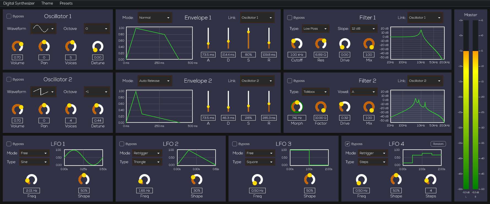
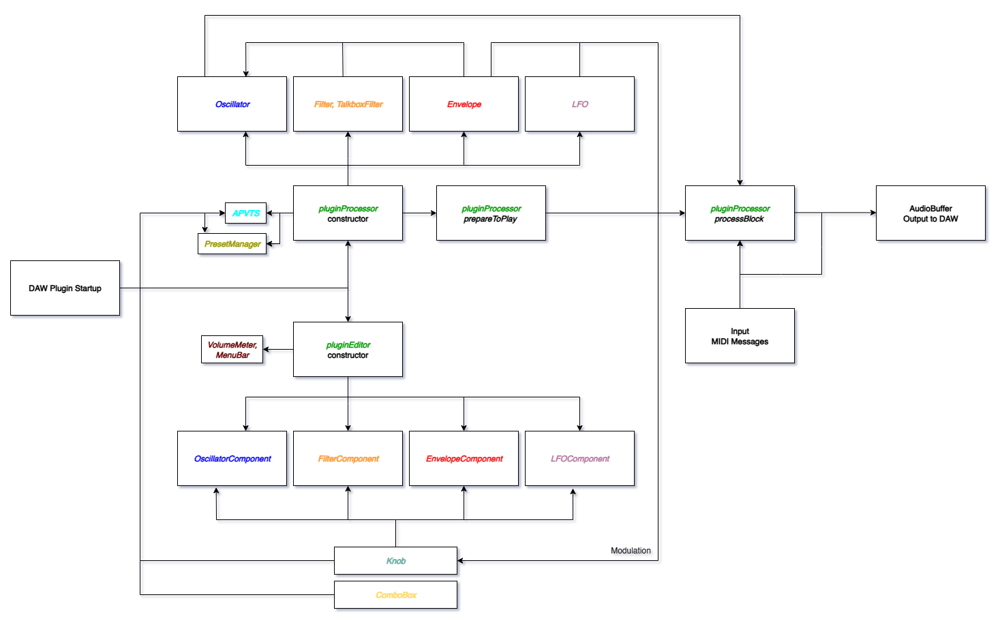

# Digital Synthesizer

**Digital Synthesizer VST Plugin**  
Final Electrical Engineering Project · Tel Aviv University · 2025  
*By Dor Zayonch & Matan Doron*



---

## Project Overview

This project presents a real-time digital synthesizer plugin developed using C++ and the JUCE framework.  
It is based on **subtractive synthesis**, a method where waveforms are shaped using filters, envelopes, and modulators.

The plugin supports real-time MIDI input, polyphonic voice handling, and visual feedback for parameters and modulation.  
Its standout feature is a **Talkbox filter** that uses formant shaping to give the synthesizer a vocal, speech-like character.

This synthesizer combines practical digital signal processing (DSP) techniques with computer engineering, bridging theory and implementation in a creative, hands-on project.

### Demo Video

<p align="center">
  <a href="https://www.youtube.com/watch?v=txyHE1rODb0">
    
  </a>
</p>

---

## Features

- **Real-time MIDI input** with sample-accurate timing.  
- **Polyphonic voice handling** with up to 16 concurrent notes.  
- **Oscillators** supporting classic waveforms (sine, saw, square, triangle, white noise).  
- **ADSR envelope** with customizable attack, decay, sustain, and release.  
- **Filter module** with low-pass, high-pass, band-pass, and Talkbox filter modes.  
- **LFO module** with free/retrigger mode, shape control, and visual feedback.  
- **Preset manager** for saving, loading, and initializing sound presets.  
- **Volume meter** with real-time stereo level monitoring and colored dB scale.  
- **Modular architecture** for easy debugging, and future expansion.  

---


## Architecture Diagram

The synthesizer follows a modular architecture that separates DSP logic, GUI components, and parameter management.

Each major module (Oscillator, Envelope, Filter, LFO, etc.) operates independently and communicates through the plugin’s main processor using JUCE’s APVTS system.



---

## Source Code

The entire plugin is organized under the `Source/` folder.  
It includes modular components for DSP and GUI, shared utilities, and the main plugin entry points.
Each folder contains self-contained logic and interface elements.  

```
Source/
├── Assets/
├── Modules/
│ ├── ComboBox/
│ │ ├── ComboBox.h/.cpp
│ ├── Envelope/
│ │ ├── Envelope.h/.cpp
│ │ ├── EnvelopeComponent.h/.cpp
│ │ ├── EnvelopeGraph.h/.cpp
│ ├── Filter/
│ │ ├── Filter.h/.cpp
│ │ ├── FilterComponent.h/.cpp
│ │ ├── FilterGraph.h/.cpp
│ │ ├── TalkBoxFilter.h/.cpp
│ ├── Knob/
│ │ ├── Knob.h/.cpp
│ │ ├── KnobModulation.h/.cpp
│ │ ├── ModulationTarget.h/.cpp
│ ├── LFO/
│ │ ├── LFO.h/.cpp
│ │ ├── LFOComponent.h/.cpp
│ │ ├── LFOGraph.h/.cpp
│ ├── Linkable/
│ │ ├── Linkable.h
│ │ ├── LinkableUtils.h
│ ├── MenuBar/
│ │ ├── MenuBar.h/.cpp
│ ├── Oscillator/
│ │ ├── Oscillator.h/.cpp
│ │ ├── OscillatorComponent.h/.cpp
│ ├── PresetManager/
│ │ ├── PresetManager.h/.cpp
│ ├── VolumeMeter/
│ │ ├── VolumeMeter.h/.cpp
├── Common.h/.cpp
├── PluginEditor.h/.cpp  
├── PluginProcessor.h/.cpp
```

Each `.h` file includes **Doxygen-style documentation**, with detailed comments describing the role of each class, its methods, and members.

---

## How to Use the Plugin

To use the plugin in your DAW, simply copy the file:

```
DigitalSynthesizer.vst3
```

from the main folder of this repository into your system’s default VST3 plugin folder.

For example, on Windows:
```
C:\Program Files\Common Files\VST3
```

Then, restart your DAW and load the plugin on a MIDI track.

---

## Build Instructions (Windows)

This project uses the **JUCE framework (v8.0.2)** for both audio processing and GUI development.
(https://github.com/juce-framework/JUCE)   
Make sure JUCE is set up properly before building.

To build the plugin on Windows:

1. Open the project in **Visual Studio**.
2. Select the **x64 Release** build configuration.
3. Build the solution.

After building, the generated VST3 plugin will be located at:

```
Builds\VisualStudio2022\x64\Release\VST3\DigitalSynthesizer.vst3\Contents\x86_64-win
```
---

## Credits

**Supervisor**  
- Dr. Lior Arbel

**Project Authors**  
- Dor Zayonch  
- Matan Doron  

This project was completed as part of the final Electrical Engineering project at **Tel Aviv University (2025)**.

---

## References

[1] JUCE, "JUCE: The C++ Framework for Audio Applications" (Version 8.0.2), SoundStax Ltd., 2023.  
Available online: https://juce.com/learn/documentation/

[2] G. E. Peterson & H. L. Barney, "Control Methods Used in a Study of the Vowels,"  
*The Journal of the Acoustical Society of America*, 24(2), pp. 175–184, 1952.

[3] M. Müller, *Fundamentals of Music Processing: Audio, Analysis, Algorithms, Applications*,  
2nd ed., Cham, Switzerland: Springer, 2021.

[4] J. O. Smith, *Introduction to Digital Filters: With Audio Applications*, W3K Publishing, 2007.